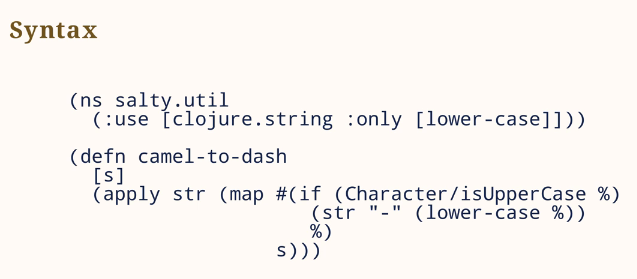
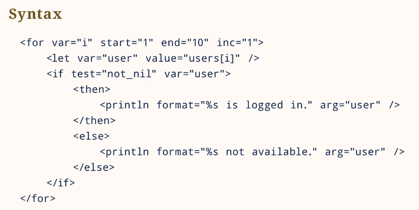
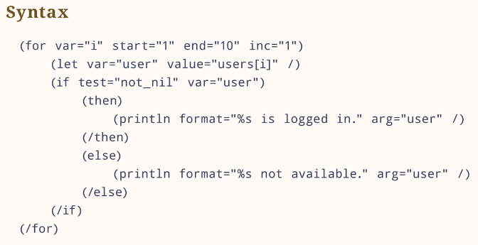
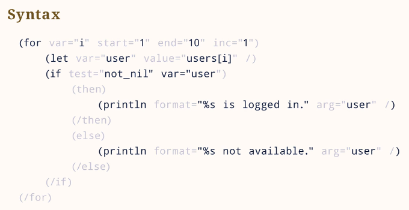
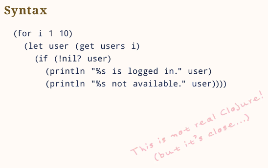
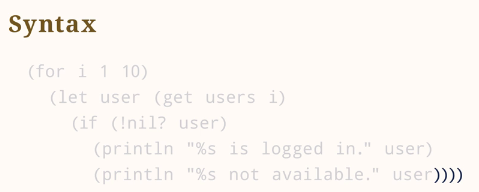

# :mortar_board: Понимание синтаксиса

В Clojure имя функции и её аргументы находятся внутри скобок, например
```clojure
(count foo) ;; Clojure
```
, что эквивалентно
```php
count($foo) // PHP
```

Теперь посмотрим на более сложный код:



С первого взгляда ничего не понятно! Но тут есть небольшой трюк: представьте xml-подобный язык шаблонизатора, в котором есть теги if, for или тег присваивающий значение переменной:



Теперь заменим угловые скобки на круглые скобки:



Немного упросим, убрав имена атрибутов, лишние кавычки и некоторые теги:



И в тоге получаем Clojure! (на самом деле, это ещё не Clojure, но уже очень близко):



Немного попрактиковавшись, вы обнаружите, что такой синтаксис даже удобнее, чем старый-добрый классический Си-подобный. Синтаксис Clojure компактный, выразительный и достаточно легко читаемый.

Единственное, что может смущать, это количество закрывающих скобок в конце, которые принято располагать на одной строке:



Однако, в реальной жизни это не проблема, т.к. все современные редакторы и IDE умеют подсвечивать парные скобки.
